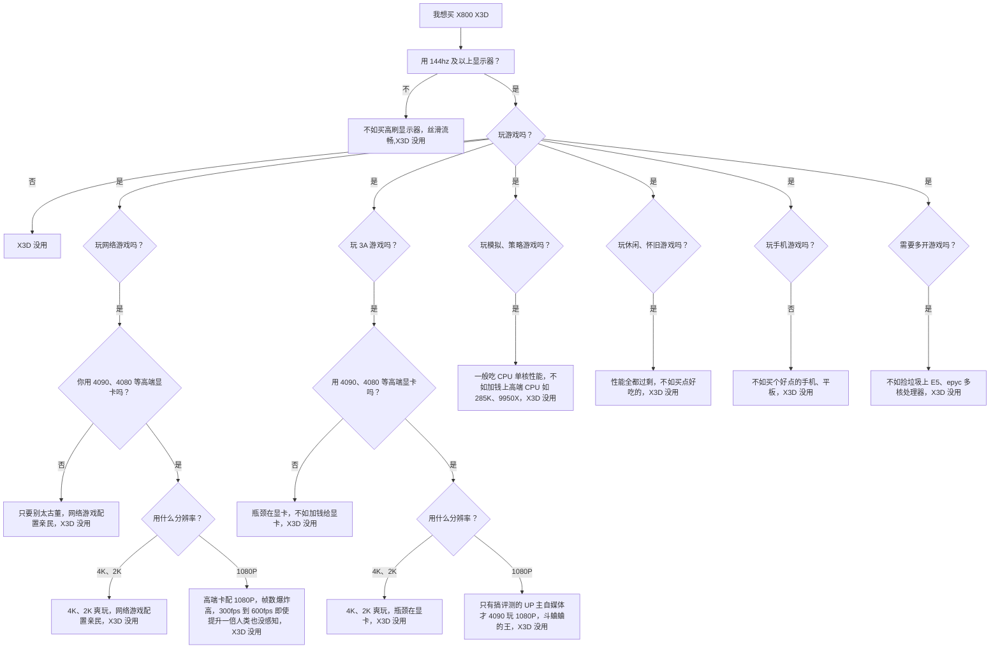

```mermaid
flowchart 
    A[我想买 X800 X3D] --> B[用 144hz 及以上显示器？]
    B --不--> C[不如买高刷显示器，丝滑流畅,X3D 没用]
    B --是--> X{玩游戏吗？}
    X --否--> Y[X3D 没用]
    X --是--> D{玩网络游戏吗？}
    D --是--> H{你用 4090、4080 等高端显卡吗？}
    H --否--> I[只要别太古董，网络游戏配置亲民，X3D 没用]
    H --是--> J{用什么分辨率？}
    J --4K、2K--> K[4K、2K 爽玩，网络游戏配置亲民，X3D 没用]
    J --1080P--> L[高端卡配 1080P，帧数爆炸高，300fps 到 600fps 即使提升一倍人类也没感知，X3D 没用]
    X --是--> E{玩 3A 游戏吗？}   
    E --是--> M{用 4090、4080 等高端显卡吗？}
    M --否--> N[瓶颈在显卡，不如加钱给显卡，X3D 没用]
    M --是--> O{用什么分辨率？}
    O --4K、2K--> P[4K、2K 爽玩，瓶颈在显卡，X3D 没用]
    O --1080P--> Q[只有搞评测的 UP 主自媒体才 4090 玩 1080P，斗蛐蛐的王，X3D 没用]
    X --是--> F{玩模拟、策略游戏吗？}
    F --是--> R[一般吃 CPU 单核性能，不如加钱上高端 CPU 如 285K、9950X，X3D 没用]
    X --是--> G{玩休闲、怀旧游戏吗？}
    G --是--> S[性能全都过剩，不如买点好吃的，X3D 没用]
    X --是--> T{玩手机游戏吗？}
    T --否--> W[不如买个好点的手机、平板，X3D 没用]
    X --是--> U{需要多开游戏吗？}
    U --是--> V[不如捡垃圾上 E5、epyc 多核处理器，X3D 没用]
```