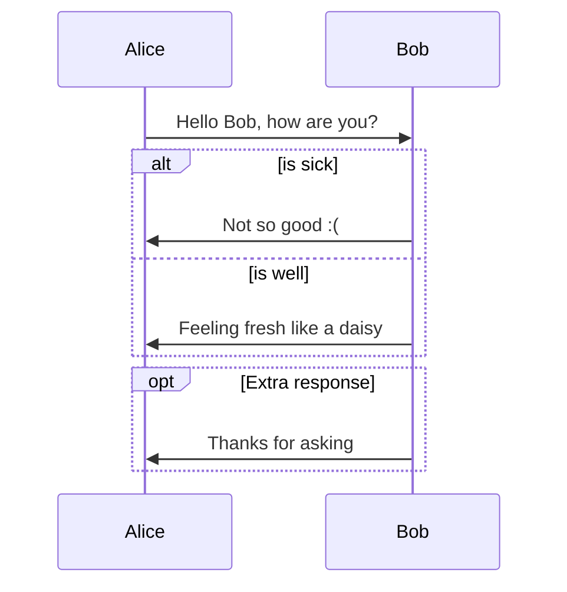
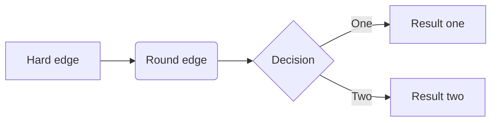
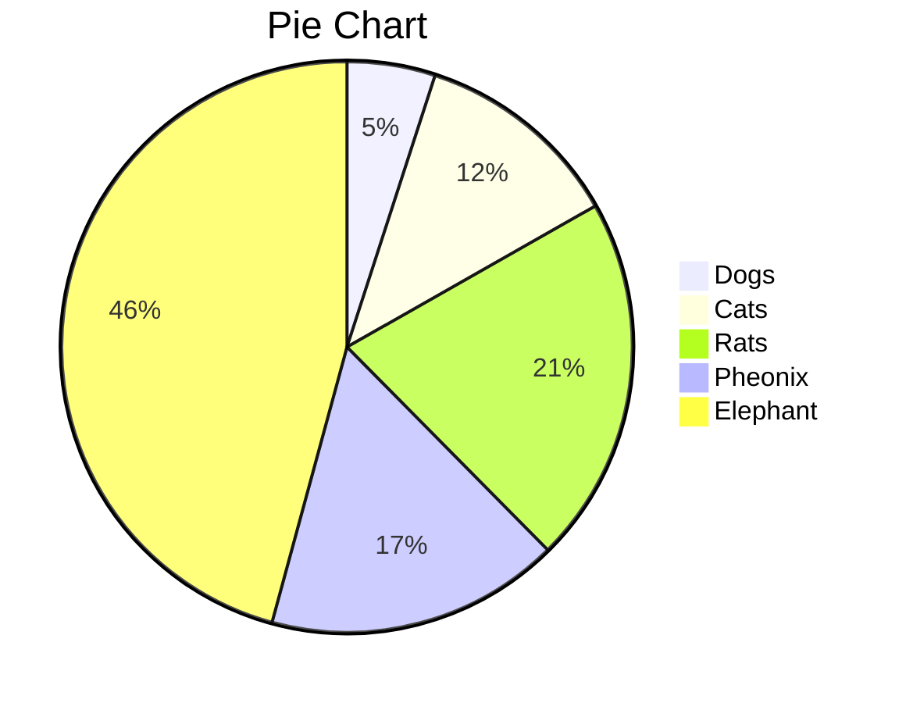

## Markdown Basics and This is Heading 2

### Headings and This is Heading 3

```markdown
# Heading 1
## Heading 2
### Heading 3
#### Heading 4
##### Heading 5
###### Heading 6
```
#### Heading 4
##### Heading 5
###### Heading 6

### Text Decorations

**Use 2 asterisks `**` for bold text**, __Use 2 underscores `__` for bold text__  
*Use asterisk `*` for bold italic text*, _Use underscore `_` for italic italicext_  
***Use asterisk `*` for bold and italic text***, **_hybrid symbol for bold and italic text_**  
`Use backtick for keyword`  
<u>Use HTML tag for underlined text</u>  
~~Use tidle `~~` for struck-through text~~

```markdown
**Use 2 asterisks for bold text**, __Use 2 underscores for bold text__  
*Use asterisk for bold italic text*, _Use underscore for italic italicext_  
***Use asterisk for bold and italic text***, **_hybrid symbol for bold and italic text_**  
`Use backtick for keyword`  
<u>Use HTML tag for underlined text</u>  
~~Use tidle for struck-through text~~
```

### Paragraph and lists

Leave a blank line between 2 paragraphs. This is paragraph 1. 
A single line break is considered part of the same paragraph and will not be displayed.

This is paragraph 2. Use two blanks to break a line.<!-- 2 spaces after -->  
Another way to break a line is using a `<br>` tag.<br> 
This is the last sentence of paragraph 2.

```markdown
Leave a blank line between 2 paragraphs. This is paragraph 1.
A single line break is considered part of the same paragraph and will not be displayed.

This is paragraph 2. Use two blanks to break a line.<!-- 2 spaces after -->  
Another way to break a line is using a `<br>` tag.<br> 
This is the last sentence of paragraph 2.
```

Use numbers followed by a period for an ordered list.
1. This the first item, 
2. This the second item.
   1. Nested lists is supported by inserting 2 to 4 spaces before numbers.
   2. This is the second sub-item. <!-- 2 spaces after ->  -->   
   In a list, to start a new line, leave 2 spaces after last line, or use HTML tag `<br>`.
      1. This is the first sub sub item.

         In a list, to start a new paragraph, leave a blank line and then add the appropriate number of spaces before the new paragraph.

```markdown
Use numbers followed by a period for an ordered list.
1. This the first item, 
2. This the second item.
   1. Nested lists is supported by inserting 2 to 4 spaces before numbers.
   2. This is the second sub-item. <!-- 2 spaces after ->  -->   
   In a list, to start a new line, leave 2 spaces after last line, or use HTML tag `<br>`.
      1. This is the first sub sub item.

         In a list, to start a new paragraph, leave a blank line and then add the appropriate number of spaces before the new paragraph.
```

Use hyphen `-`, asterisk `*`, or plus `+` for bullet points. 
- This is an unordered list.
   - Nested lists is supported by inserting 2 to 4 spaces before symbols.
   * Sub-item 2
   + Sub-item 3<!-- 2 spaces after ->  -->  
   In a list, to start a new line, leave 2 spaces after last line, or use HTML tag `<br>`.
      + Nested lists is supported by inserting 2 to 4 spaces before numbers.

        In a list, to start a new paragraph, leave a blank line and then add the appropriate number of spaces before the new paragraph.

```markdown
Use hyphen `-`, asterisk `*`, or plus `+` for bullet points. 
- This is an unordered list.
   - Nested lists is supported by inserting 2 to 4 spaces before symbols.
   * Sub-item 2
   + Sub-item 3<!-- 2 spaces after ->  -->  
   In a list, to start a new line, leave 2 spaces after last line, or use HTML tag `<br>`.
      + Nested lists is supported by inserting 2 to 4 spaces before numbers.

        In a list, to start a new paragraph, leave a blank line and then add the appropriate number of spaces before the new paragraph.
```

Use `- [ ]` for an unchecked box and `- [x]` for a checked box:

- [ ] Task 1
- [x] Task 2 (Completed)

```markdown
- [ ] Task 1
- [x] Task 2 (Completed)
```

### Links and Imgaes

Create links using `[text](URL)`:

```markdown
[markdown](https://markdown.com)
```

Images are similar to links, but with an exclamation mark `!` before the square brackets:

```markdown

```

### 6. **Blockquotes**

Use `>` for blockquotes:

> This is a blockquote.
> 
> This is part of the same blockquote.

```markdown
> This is a blockquote.
> 
> This is part of the same blockquote.
```

### 7. **Code**
- Inline Code: Use backticks `` abc `` for inline code.
- Code Block: Use triple backticks ```` ``` ```` or indent by 4 spaces.

```markdown
`inline code`

```
Code block
```

### 8. **Horizontal Rule**
Use three or more dashes `---`, asterisks `***`, or underscores `___`:

```markdown
---
```

### 9. **Tables**

Create tables using pipes `|` and dashes `-`:

```markdown
| Header 1 | Header 2 |
|----------|----------|
| Row 1    | Cell 1   |
| Row 2    | Cell 2   |
```

### 10. **Escaping Characters**
To escape special characters (like `*`, `_`, `#`, etc.), use a backslash `\`:

\*escaped asterisk\*

```markdown
\*escaped asterisk\*
```

### 11. **Task Lists**
Use `- [ ]` for an unchecked box and `- [x]` for a checked box:

```markdown
- [ ] Task 1
- [x] Task 2 (Completed)
```

---

This is a concise overview of commonly used Markdown syntax. It is very useful for formatting text in documentation, wikis, readme files, and more!

原文举例：

```markdown
_斜体字_ **粗体字** <u>下划线</u> `关键字`
```

> 键入反单引号：单击 Tab 上方的按键。

### 3 列表

#### 3.1 无序列表

- 使用“\*”或“-”后增加**空格**，代表无序列表。
  - 在“\*”或“-”前插入**两个空格**（或 Tab），代表次级列表。


#### 3.2 有序列表

1. 在“数字”后增加英文句号“."和**空格**“ ”，代表有序列表。
   1. 在“数字”、英文句号“."、**空格**“ ”前插入**两个空格**（或 Tab），代表次级列表。

> 有序列表和无序列表**可以混合使用**。
>
> 有序列表的**序号是自动排列**的。

#### 3.3 复选框列表

在“数字”、英文标点“.”后添加“[ ]” 代表未勾选；添加“[x]”代表已勾选。

1. [x] 步骤一
2. [ ] 步骤二
3. [ ] 结束


### 4 常用格式

#### 4.1 引用

> 在内容前方添加小于号“>”和空格。
>
> 引用中，**可以使用**列表，各种字体样式。
>
> 1. 引用中使用有序列表
>
> - 引用中使用无序列表

#### 4.2 脚注

在需要脚注的文字后，添加左中括号“\[”，乘方符号“\^”，自定义的标记“标记”、右中括号“\]”，这将形成一个脚注的起始点。例如本处的脚注[^jiaozhu]

在文章后方，输入**同样的符号组合**，并接以**英文冒号**“:”和空格“ ”，然后键入作为脚注的内容。

举例：

```markdown
此处应有一个脚注[^jiaozhu]。这里还有[^haiyou]。

[^jiaozhu]: 这里写需要注释的内容。

[^haiyou]: 这是第二个注释。
```

> 脚注是自动排序的，无需使用者关心。

#### 4.3 插入超链接

超链接的**文本用英文中括号**包括，将**地址用英文小括号**包括。
例如：[谷歌](https://www.google.com/)

其原文为：

```markdown
[谷歌](https://www.google.com/)
```

> 超链接**支持相对地址**。

#### 4.4 插入图片

与超链接类似，只需在最前方添加英文叹号“!”。

例如：


其原文为：

```markdown

```

> **本地图片**最好使用**相对地址**，方便图片随 Markdown 文档转移位置。

如果需要控制图片的大小和位置，则需要借助HTML。div标签的aling属性可以控制位置，img标签的width和height控制大小。

例如：
```html
<!-- 插入居中，且长宽均为128的图片 -->
<div align="center"></div>
```


#### 4.5 插入分隔线

单独出现为一行的三个星号“\*\*\*”，即是横线。

---

#### 4.6 插入换行

在需要换行的段内，使用“\<br\>”换行。

#### 4.6 转义

如果要输出的内容，已经是 Markdown 的关键字，那么在前方输入反斜杠“\\”。

### 5 数学公式

Markdown 可以使用`LaTeX表达式`显示数学、物理、化学、生物公式。（调用了 MathJax。）

#### 5.1 行内公式

在文章段落中包含公式，可用货币符号“\$”符号将 LaTeX 表达式包围。如：$$f = \frac{2 \pi}{T}$$

> Typora 使用行内公式时，需要在“文件-首选项-Markdown-语法支持”中勾选“行内公式”复选框。

> Jekyll 的行内公式使用**两个**“$”包围，Typora 则是一个。

#### 5.2 公式块

使用另外的段落显示公式，则第一行以**两个货币符号**“\$”开头，中间输入 LaTeX 表达式，最后以**两个货币符号**“\$”结尾。

$$
\begin{align*}
y = y(x,t) &= A e^{i\theta} \\
&= A (\cos \theta + i \sin \theta) \\
&= A (\cos(kx - \omega t) + i \sin(kx - \omega t)) \\
&= A\cos(kx - \omega t) + i A\sin(kx - \omega t)  \\
&= A\cos \Big(\frac{2\pi}{\lambda}x - \frac{2\pi v}{\lambda} t \Big) + i A\sin \Big(\frac{2\pi}{\lambda}x - \frac{2\pi v}{\lambda} t \Big)  \\
&= A\cos \frac{2\pi}{\lambda} (x - v t) + i A\sin \frac{2\pi}{\lambda} (x - v t)
\end{align*}
$$

### 6 绘制流程图、顺序图

各类图表借助 Mermaid 插件实现。参见：https://support.typora.io/Draw-Diagrams-With-Markdown/

Mermaid支持顺序图、流程图、类图、状态图、甘特图等多种类型。

#### 6.1 顺序图



#### 6.2 流程图



#### 6.3 饼图



### 7 代码块

代码前方键入**三个反单引号**“```”，并输入**编程语言名称**（如：python），表示代码**开始**。

代码后方健入**三个反单引号**“```”，表示代码**结束**。

```python
## Python 快速排序
def partition(arr,low,high):
    i = ( low-1 )
    pivot = arr[high]
    for j in range(low , high):
        if   arr[j] <= pivot:
            i = i+1
            arr[i],arr[j] = arr[j],arr[i]
    arr[i+1],arr[high] = arr[high],arr[i+1]
    return ( i+1 )

def quickSort(arr,low,high):
    if low < high:
        pi = partition(arr,low,high)
        quickSort(arr, low, pi-1)
        quickSort(arr, pi+1, high)
```

### 8 更多功能

除了上述基础功能，Markdown 还支持：

1. Markdown语法允许生成清晰的表格，详见：[菜鸟教程](https://www.runoob.com/markdown/md-table.html)。
2. VS Code、Typora等支持生成**自动更新的目录**。
3. 嵌入 HTML5 标记语言。
4. 使用Emoji :smile:，详见：[webfx.com](https://www.webfx.com/tools/emoji-cheat-sheet/)

## Markdown 笔记的哲学

Markdown 定义的多种默认格式，涵盖了 90%文档所需。

省去了用户自己设计文档格式的时间，全都交由软件处理。

没有设计就是最好的设计，生成的文档统一、标准、简洁。

[^jiaozhu]: 这是一个脚注的示例。
